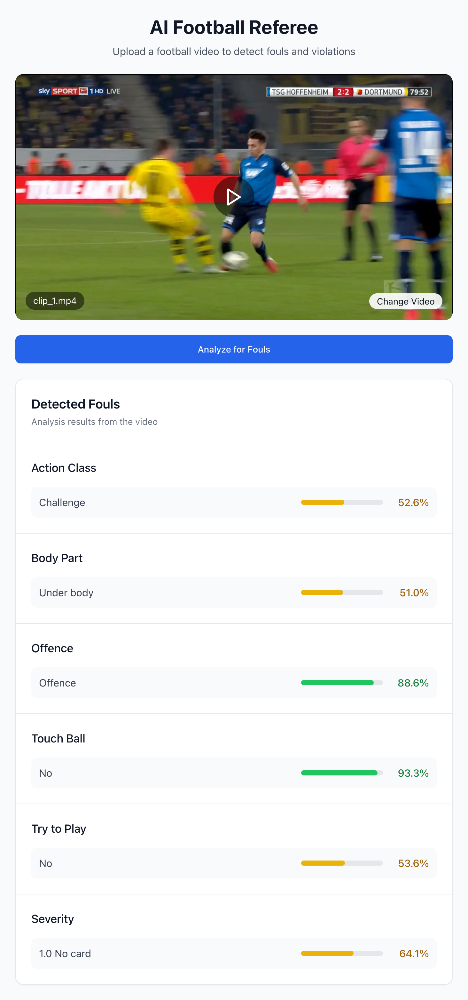

# 📊 AI Football Referee

Sick of refs getting it wrong?

Introducing Multi-View Foul Recognition, the AI-powered solution designed to make football refereeing more accurate and fair. By leveraging multiple camera angles, this system can detect fouls with precision and assist referees in making real-time decisions based on comprehensive video analysis. Say goodbye to missed calls and controversial decisions!

<div align="center">
  
</div>

## 🌟 Overview

The AI Football Referee is a modern web application that analyzes video clips of football incidents to provide instant referee decisions with explanations. Leveraging state-of-the-art deep learning models and computer vision techniques, the system recognizes actions like tackles, challenges, and fouls, then makes referee decisions based on official football regulations.

## ✨ Key Features

- **Video Upload & Analysis**: Upload video clips of football incidents for automated analysis
- **Multi-task Deep Learning**: Advanced model that detects multiple aspects of football incidents:
  - Action classification (tackling, holding, elbowing, etc.)
  - Body part involvement
  - Touch ball detection
  - Intent analysis (try to play detection)
  - Severity assessment
- **Referee Decision Generation**: AI-generated referee decisions with natural language explanations
- **Visual Results Display**: Interactive UI showing model confidence for each detected aspect
- **Real-time Processing**: Fast video processing and inference pipeline

## 🏗️ Project Structure

The project is divided into two main components:

### Backend (Python/FastAPI)
- Deep learning models for video analysis
- FastAPI server for handling video uploads and inference
- Multi-task learning pipeline
- Video feature extraction

### Frontend (Next.js)
- Modern, responsive UI built with Next.js and TypeScript
- Real-time video upload and processing interface
- Interactive results display
- ShadCN UI components for a polished look

## 🔧 Technology Stack

- **Backend**: 
  - Python 3.10+
  - FastAPI
  - PyTorch
  - OpenCV
  - Azure OpenAI for explanation generation
  - SoccerNet for dataset access

- **Frontend**:
  - Next.js 15
  - TypeScript
  - Zustand for state management
  - Tailwind CSS
  - ShadCN UI
  - Axios for API requests

## 📋 Prerequisites

- Python 3.10 or higher
- Node.js 20.x or higher
- CUDA-compatible GPU (recommended for faster inference)
- Azure OpenAI API access (for explanation generation)
- SoccerNet access credentials (for dataset access during development)

## 🚀 Getting Started

### Backend Setup

1. Create a virtual environment:
   ```bash
   python -m venv venv
   source venv/bin/activate  # On Windows: venv\Scripts\activate
   ```

2. Install dependencies:
   ```bash
   pip install -r requirements.txt
   ```

3. Create a `.env` file with the following variables:
   ```
   AZURE_OPENAI_API_KEY=your_azure_openai_key
   AZURE_OPENAI_ENDPOINT=your_azure_openai_endpoint
   AZURE_OPENAI_API_VERSION=your_azure_openai_api_version
   AZURE_OPENAI_DEPLOYMENT_NAME=your_azure_openai_deployment
   SOCCERNET_PASSWORD=your_soccernet_password  # Only needed for dataset access/training
   ```

4. Start the backend server:
   ```bash
   cd backend
   python app.py
   ```

### Frontend Setup

1. Install dependencies:
   ```bash
   cd frontend
   npm install
   ```

2. Create a `.env.local` file:
   ```
   NEXT_PUBLIC_API_URL=http://localhost:5000
   ```

3. Start the development server:
   ```bash
   npm run dev
   ```

4. Access the application at `http://localhost:3000`

## 📄 API Documentation

Once the backend is running, you can access the API documentation at `http://localhost:5000/docs`.

Key endpoints:
- `POST /api/inference`: Analyzes uploaded video and returns referee decision

## 📚 Model Training

The system uses deep learning models trained on the SoccerNet MVFouls dataset, which contains annotated video clips of football incidents.

To train your own models:
1. Set up the SoccerNet credentials in the `.env` file
2. Run the download script to get the dataset:
   ```bash
   python backend/data/loading/mvfouls-download.py
   ```
3. Run the training pipeline:
   ```bash
   python backend/training/training_pipeline.py
   ```

Pre-trained models can be found in the `backend/pretrained_models` directory.

## 🧪 Testing

### Backend Tests
```bash
cd backend
python -m pytest
```

### Frontend Tests
```bash
cd frontend
npm run test
```

## 🔍 How It Works

1. **Video Upload**: User uploads a video clip of a football incident
2. **Feature Extraction**: The system extracts temporal and spatial features from the video
3. **Multi-Task Inference**: The deep learning model analyzes multiple aspects of the incident
4. **Decision Generation**: Based on the analysis, the system generates a referee decision
5. **Explanation**: An AI-powered explanation of the decision is generated
6. **Result Display**: The user interface displays the decision and explanation to the user

## 🤝 Contributing

Contributions are welcome! Please feel free to submit a Pull Request.

1. Fork the repository
2. Create your feature branch (`git checkout -b feature/amazing-feature`)
3. Commit your changes (`git commit -m 'Add some amazing feature'`)
4. Push to the branch (`git push origin feature/amazing-feature`)
5. Open a Pull Request

## 📝 License

This project is licensed under the MIT License - see the LICENSE file for details.

## 🙏 Acknowledgements

- [SoccerNet](https://www.soccer-net.org/) for providing the MVFouls dataset
- [PyTorch](https://pytorch.org/) for the deep learning framework
- [FastAPI](https://fastapi.tiangolo.com/) for the API framework
- [Next.js](https://nextjs.org/) for the frontend framework
- [ShadCN UI](https://ui.shadcn.com/) for the UI components
