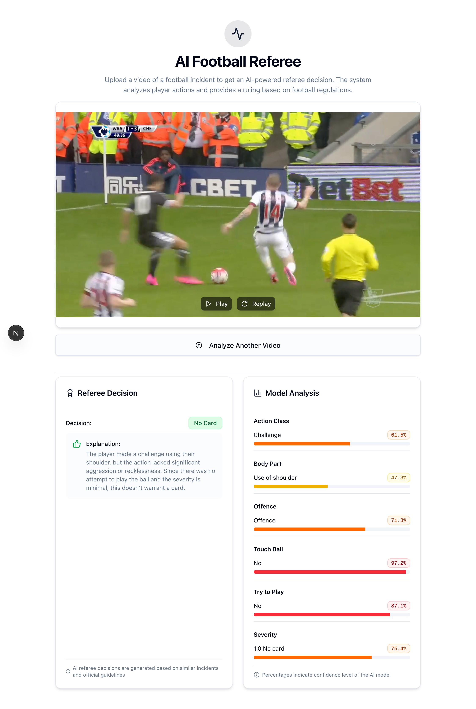

# Multi-View Foul Recognition

Sick of refs getting it wrong?

Introducing Multi-View Foul Recognition, the AI-powered solution designed to make football refereeing more accurate and fair. By leveraging multiple camera angles, this system can detect fouls with precision and assist referees in making real-time decisions based on comprehensive video analysis. Say goodbye to missed calls and controversial decisions!



## 🚀 Features

* Multi-Angle Video Analysis: Analyzes footage from multiple camera angles to accurately detect fouls in football matches.
* AI-Powered Recognition: Uses machine learning to distinguish between different types of fouls, ensuring consistent and fair officiating.
* Real-Time Decision Support: Provides immediate feedback to referees, reducing human error and enhancing match integrity.
* Scalable: Easily integrates with existing camera setups to process live footage or pre-recorded matches.
* Open Source: Free for anyone to use, modify, and contribute to the development of more accurate foul detection systems.

## 📚 Dataset

This project uses the SoccerNet-MVFoul dataset, which can be downloaded via API:

```bash
from SoccerNet.Downloader import SoccerNetDownloader as SNdl
mySNdl = SNdl(LocalDirectory="path/to/SoccerNet")
mySNdl.downloadDataTask(task="mvfouls", split=["train","valid","test","challenge"], password="enter password")
```

The incident tends to occur close to frame 75 (3 seconds) so previous studies have taken frames 63 to 87 as input.

## Prerequisites

- Python 3.8+
- Node.js 16+
- npm/yarn

## Installation & Setup

1. First, install the Python dependencies:

```bash
pip install -r requirements.txt
```

2. Install the frontend dependencies:

```bash
cd video-foul-detection
npm install
```

## Running the Application

The application requires both the backend and frontend servers to be running.

1. Start the Flask backend server:

```bash
# From the root directory
python app.py
```

The backend will run on `http://localhost:5000`

2. In a new terminal, start the React frontend development server:

```bash
cd video-foul-detection
npm run dev
```

The frontend will run on `http://localhost:5173`

3. Open your browser and navigate to `http://localhost:5173` to use the application

## Usage

1. Click "Choose Video" or drag and drop a video file into the upload area
2. The video will be displayed with playback controls
3. Click "Analyze for Fouls" to process the video
4. View the analysis results showing:
   - Detected actions/fouls
   - Confidence scores
   - Severity assessments
   - Additional match insights

## Technical Details

### Backend (Python/Flask)
- Flask server with CORS support
- Custom video processing pipeline
- PyTorch-based deep learning models
- HDF5 feature extraction and storage

### Frontend (React)
- Built with Vite
- TailwindCSS for styling
- Real-time video playback
- Interactive results visualization
- Responsive design

## ⚙️ How It Works

This project uses advanced machine learning techniques to detect fouls in football matches through multi-angle video footage. Here's a breakdown of how the system operates:

* Input Video: The system takes in a football match video captured from multiple camera angles.
* Video Processing: Using OpenCV, the video is processed to extract frames from different angles.
* AI Analysis: The extracted frames are analyzed using a pre-trained deep learning model, which has been trained to detect common football fouls (like tackles, handballs, or off-the-ball incidents).
* Decision Support: The system identifies potential fouls and marks them, providing timestamps and a confidence score for each detection.
* Referee Assistance: The system can provide suggestions to the referee, who can review the identified foul instances for a more informed decision.

## 📂 Folder Structure

```bash
/multi-view-foul-recognition
├── app.py                      # Flask backend server
├── inference_pipeline.py       # Video processing pipeline
├── training_pipeline.py        # Model trainig pipeline
├── test_pipeline.py            # Model testing pipeline
├── models/                     # Model definitions
├── utils/                      # Helper utilities
├── video-foul-detection/       # React frontend
    ├── src/
    │   ├── components/        
    │   └── App.jsx            
    └── package.json
```

## 🤝 Contributing

We welcome contributions from the community! If you have ideas to improve the system or fix bugs, feel free to fork the repository and submit a pull request.

### Steps to Contribute:

1. Fork the repository.
2. Create a new branch `git checkout -b feature-branch`.
3. Make your changes.
4. Commit your changes `git commit -am 'Add new feature'`.
5. Push to your branch `git push origin feature-branch`.
6. Create a new pull request.

## License

MIT License